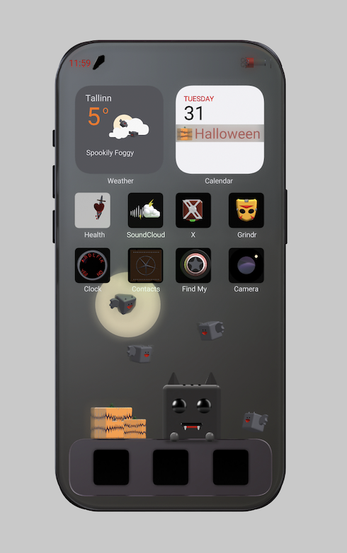

# 🧟📱 Iphone Nightmares



A 3d Model visualization project where the user can interact with the model view

## Description

🎃 "Iphone Nightmares" is a creative project featuring 3D renders inspired by Halloween, developed as a submission for the [004 Threejs Journey Challenge](https://threejs-journey.com/challenges/004-halloween). In this challenge, we explore the world of 3D renders and Halloween themes, drawing inspiration from each iPhone icon displayed on the screen.

## Setup

### Install dependencies

Once you've cloned the repository install the required dependencies:

```sh
yarn 
```

## Run

### Development server

To run the project in development mode run:

```sh
yarn start
```


## To Visit App:

Open [http://localhost:3000](http://localhost:3000) to view it in the browser.

## Technologies Used

- JavaScript
- React
- Typescript
- Three.js 
- React-Three/Fiber
- React-Three/Drei

## Try it out!

<a href="https://3d-modeling.vercel.app/" target="_blank">3d Model</a>

### Thank you 🎃

### ⚰⚰️ Gustavo Magnago 🧟
